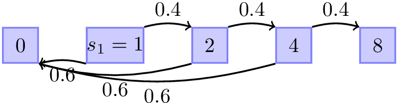

DATA 605 - Assignment 10
================
Joshua Sturm
April 15, 2018

Question 1
==========

Smith is in jail and has 1 dollar; he can get out on bail if he has 8 dollars. A guard agrees to make a series of bets with him. If Smith bets A dollars, he wins A dollars with probability .4 and loses A dollars with probability .6. Find the probability that he wins 8 dollars before losing all of his money if

(a) he bets 1 dollar each time (timid strategy).
------------------------------------------------

(b) he bets, each time, as much as possible but not more than necessary to bring his fortune up to 8 dollars (bold strategy).
-----------------------------------------------------------------------------------------------------------------------------

(c) Which strategy gives Smith the better chance of getting out of jail?
------------------------------------------------------------------------

Solutions
=========

This is known as the Gambler's Ruin problem.

We are given:

Initial stake *z* = *k* = 1.

*M* = 8

*P* = 0.4

*q* = 0.6

$q\_z = \\frac{(\\frac{q}{p})^z - 1}{(\\frac{q}{p})^M - 1}$

(a)
---

$q\_z = \\frac{(\\frac{0.6}{0.4})^1 - 1}{(\\frac{0.6}{0.4})^8 - 1} =$ 0.0203013.

There is a ~2% probability Smith will win using this strategy.

(b)
---

The quickest strategy is if he bets everything each time. That is, beginning from state *z* = *k* = 1, he can move fall to 0 with *q* = 0.6, or rise to 2 with *p* = 0.4. Similarly, suppose he moved to 2, he bets everything, and can fall to 0 with *q* = 0.6, or rise to 4 with *p* = 0.4.

Using the formula *q**k* = *p* ⋅ *q**k* + 1 + *q* ⋅ *q**k* − 1:

*q*0 = 0

*q*1 = (0.4)*q*2 + (0.6)*q*0

*q*2 = (0.4)*q*4 + (0.6)*q*0

*q*4 = (0.4)*q*8 + (0.6)*q*0

*q*8 = 1

(0.4)3= 0.064.

References
==========

-   <http://people.math.umass.edu/~lr7q/ps_files/teaching/math456/Week4.pdf>
