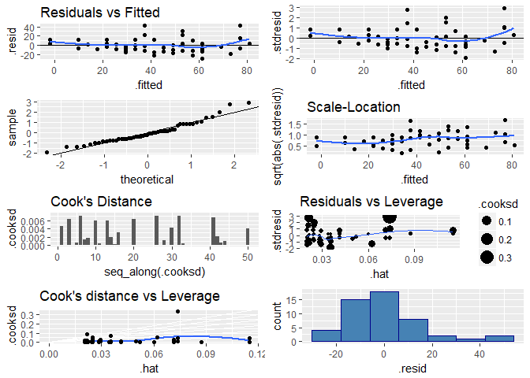

DATA 605 - Assignment 11
================
Joshua Sturm
April 22, 2018

Using the `cars` dataset in R, build a linear model for stopping distance as a function of speed and replicate the analysis of your textbook chapter 3 (visualization, quality evaluation of the model, and residual analysis.)

``` r
library(tidyverse)
library(gridExtra)
```

``` r
data <- cars
glimpse(data)
## Observations: 50
## Variables: 2
## $ speed <dbl> 4, 4, 7, 7, 8, 9, 10, 10, 10, 11, 11, 12, 12, 12, 12, 13...
## $ dist  <dbl> 2, 10, 4, 22, 16, 10, 18, 26, 34, 17, 28, 14, 20, 24, 28...
```

The dataset contains 2 variables, and 50 cases.

``` r
model <- lm(formula = dist ~ speed,
            data = data)
summary(model)
## 
## Call:
## lm(formula = dist ~ speed, data = data)
## 
## Residuals:
##     Min      1Q  Median      3Q     Max 
## -29.069  -9.525  -2.272   9.215  43.201 
## 
## Coefficients:
##             Estimate Std. Error t value Pr(>|t|)    
## (Intercept) -17.5791     6.7584  -2.601   0.0123 *  
## speed         3.9324     0.4155   9.464 1.49e-12 ***
## ---
## Signif. codes:  0 '***' 0.001 '**' 0.01 '*' 0.05 '.' 0.1 ' ' 1
## 
## Residual standard error: 15.38 on 48 degrees of freedom
## Multiple R-squared:  0.6511, Adjusted R-squared:  0.6438 
## F-statistic: 89.57 on 1 and 48 DF,  p-value: 1.49e-12
```

The model has an adjusted r-squared of 0.6438102, and a p-value of ≈ 0.

``` r

rp1 <- ggplot(model, aes(.fitted, .resid)) +
  geom_point() +
  geom_hline(yintercept = 0) +
  geom_smooth(se = FALSE) +
  labs(title = "Residuals vs Fitted")

rp2 <- ggplot(model, aes(.fitted, .stdresid)) +
  geom_point() +
  geom_hline(yintercept = 0) +
  geom_smooth(se = FALSE)

rp3 <- ggplot(model) +
  stat_qq(aes(sample = .stdresid)) +
  geom_abline()

rp4 <- ggplot(model, aes(.fitted, sqrt(abs(.stdresid)))) +
  geom_point() +
  geom_smooth(se = FALSE) +
  labs(title = "Scale-Location")

rp5 <- ggplot(model, aes(seq_along(.cooksd), .cooksd)) +
  geom_col() +
  ylim(0, 0.0075) +
  labs(title = "Cook's Distance")

rp6 <- ggplot(model, aes(.hat, .stdresid)) +
  geom_point(aes(size = .cooksd)) +
  geom_smooth(se = FALSE, size = 0.5) +
  labs(title = "Residuals vs Leverage")

rp7 <- ggplot(model, aes(.hat, .cooksd)) +
  geom_vline(xintercept = 0, colour = NA) +
  geom_abline(slope = seq(0, 3, by = 0.5), colour = "white") +
  geom_smooth(se = FALSE) +
  geom_point() +
  labs(title = "Cook's distance vs Leverage")

rp8 <- ggplot(model, aes(.resid)) +
  geom_histogram(bins = 7, color="darkblue", fill="steelblue")

grid.arrange(rp1, rp2, rp3, rp4, rp5, rp6, rp7, rp8, ncol = 2)
```



The residuals appear to be nearly normal, as can be seen in the plots `fitted vs. residuals`, `Q-Q Plot`, and the residual histogram. Taken together with the information from the model summary, we can conclude that this model is sufficiently capable of making predictions on this dataset.
