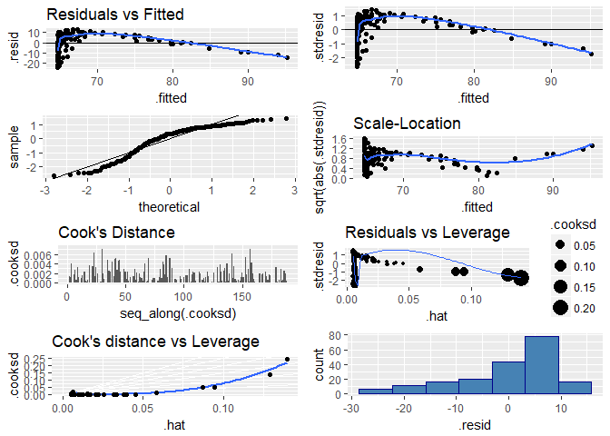

DATA 605 - Assignment 12
================
Joshua Sturm
April 29, 2018

Objective
=========

-   1.  Provide a scatterplot of LifeExp~TotExp, and run simple linear regression. Do not transform the variables. Provide and interpret the F statistics, R^2, standard error,and p-values only. Discuss whether the assumptions of simple linear regression met.

-   1.  Raise life expectancy to the 4.6 power (i.e., LifeExp^4.6). Raise total expenditures to the 0.06 power (nearly a log transform, TotExp^.06). Plot LifeExp^4.6 as a function of TotExp^.06, and r re-run the simple regression model using the transformed variables. Provide and interpret the F statistics, R^2, standard error, and p-values. Which model is "better?"

-   1.  Using the results from 3, forecast life expectancy when TotExp^.06 =1.5. Then forecast life expectancy when TotExp^.06=2.5.

-   1.  Build the following multiple regression model and interpret the F Statistics, R^2, standard error, and p-values. How good is the model?
        LifeExp = b0+b1 x PropMd + b2 x TotExp +b3 x PropMD x TotExp

-   1.  Forecast LifeExp when PropMD=.03 and TotExp = 14. Does this forecast seem realistic? Why or why not?

Import dataset
==============

Data Dictionary
---------------

Data Structure
--------------

The dataset has 9 predictor variables, and 190 cases. Each case represents a country in the world, with different statistics about their quality of healthcare.

1.
==

    ## 
    ## Call:
    ## lm(formula = LifeExp ~ TotExp, data = who)
    ## 
    ## Residuals:
    ##     Min      1Q  Median      3Q     Max 
    ## -24.764  -4.778   3.154   7.116  13.292 
    ## 
    ## Coefficients:
    ##              Estimate Std. Error t value Pr(>|t|)    
    ## (Intercept) 6.475e+01  7.535e-01  85.933  < 2e-16 ***
    ## TotExp      6.297e-05  7.795e-06   8.079 7.71e-14 ***
    ## ---
    ## Signif. codes:  0 '***' 0.001 '**' 0.01 '*' 0.05 '.' 0.1 ' ' 1
    ## 
    ## Residual standard error: 9.371 on 188 degrees of freedom
    ## Multiple R-squared:  0.2577, Adjusted R-squared:  0.2537 
    ## F-statistic: 65.26 on 1 and 188 DF,  p-value: 7.714e-14

The F-statistic for this model is 65.2641982, and the p-value is 7.7139931 × 10−14. This tells us that the relationship between the variables `LifeExp` and `TotExp` is likely not due to chance.

With a low r-squared value of 0.2576922, the model is only able to explain ≈25% of the variability. Furthermore, since the residuals are not normally distributed, as can be seen in the plots, this model is insufficient to explain the relationship between the data.

We can make use of the `gvlma` package to confirm our interpretation.

    ## 
    ## Call:
    ## lm(formula = LifeExp ~ TotExp, data = who)
    ## 
    ## Coefficients:
    ## (Intercept)       TotExp  
    ##   6.475e+01    6.297e-05  
    ## 
    ## 
    ## ASSESSMENT OF THE LINEAR MODEL ASSUMPTIONS
    ## USING THE GLOBAL TEST ON 4 DEGREES-OF-FREEDOM:
    ## Level of Significance =  0.05 
    ## 
    ## Call:
    ##  gvlma(x = model1) 
    ## 
    ##                        Value   p-value                   Decision
    ## Global Stat        56.737011 1.405e-11 Assumptions NOT satisfied!
    ## Skewness           30.532757 3.283e-08 Assumptions NOT satisfied!
    ## Kurtosis            0.002804 9.578e-01    Assumptions acceptable.
    ## Link Function      26.074703 3.285e-07 Assumptions NOT satisfied!
    ## Heteroscedasticity  0.126747 7.218e-01    Assumptions acceptable.

2.
==

    ## 
    ## Call:
    ## lm(formula = m2.LifeExp ~ m2.TotExp)
    ## 
    ## Residuals:
    ##        Min         1Q     Median         3Q        Max 
    ## -308616089  -53978977   13697187   59139231  211951764 
    ## 
    ## Coefficients:
    ##               Estimate Std. Error t value Pr(>|t|)    
    ## (Intercept) -736527910   46817945  -15.73   <2e-16 ***
    ## m2.TotExp    620060216   27518940   22.53   <2e-16 ***
    ## ---
    ## Signif. codes:  0 '***' 0.001 '**' 0.01 '*' 0.05 '.' 0.1 ' ' 1
    ## 
    ## Residual standard error: 90490000 on 188 degrees of freedom
    ## Multiple R-squared:  0.7298, Adjusted R-squared:  0.7283 
    ## F-statistic: 507.7 on 1 and 188 DF,  p-value: < 2.2e-16

    ## 
    ## Call:
    ## lm(formula = m2.LifeExp ~ m2.TotExp)
    ## 
    ## Coefficients:
    ## (Intercept)    m2.TotExp  
    ##  -736527909    620060216  
    ## 
    ## 
    ## ASSESSMENT OF THE LINEAR MODEL ASSUMPTIONS
    ## USING THE GLOBAL TEST ON 4 DEGREES-OF-FREEDOM:
    ## Level of Significance =  0.05 
    ## 
    ## Call:
    ##  gvlma(x = model2) 
    ## 
    ##                      Value   p-value                   Decision
    ## Global Stat        27.8117 1.362e-05 Assumptions NOT satisfied!
    ## Skewness           17.1372 3.478e-05 Assumptions NOT satisfied!
    ## Kurtosis            7.4581 6.315e-03 Assumptions NOT satisfied!
    ## Link Function       2.9866 8.396e-02    Assumptions acceptable.
    ## Heteroscedasticity  0.2299 6.316e-01    Assumptions acceptable.

Other than the higher standard error of 90492392, this model performs considerably better than the original one. It has an f-statistic of 507.6967054 and a p-value of 0. It has a much higher r-squared value of 0.7297673, which tells us that it's significantly better at explaining the variability in the data. From the summary plots, the residuals appear more normal, and randomly distributed, than in the first model.

In summary, this model outperforms the first by most measures, but still fails most assumptions needed for linear regression.

3.
==

3.1
---

The equation from model 2 is *y*4.6= -736527909 + 620060215⋅*x*0.06.

*y*4.6= -736527909 + 620060215 ⋅(1.5) → 193562413

$y = \\text{LifeExp} = \\sqrt\[4.6\]{193562414} \\approx$ 63.3115334

3.2
---

*y*4.6= -736527909 + 620060215 ⋅(2.5) → 813622629

$y = \\text{LifeExp} = \\sqrt\[4.6\]{813622629} \\approx$ 86.5064485

4.
==

We want to build the model LifeExp = b0+b1 x PropMd + b2 x TotExp +b3 x PropMD x TotExp.

    ## 
    ## Call:
    ## lm(formula = LifeExp ~ PropMD + TotExp + PropMD * TotExp, data = who)
    ## 
    ## Residuals:
    ##     Min      1Q  Median      3Q     Max 
    ## -27.320  -4.132   2.098   6.540  13.074 
    ## 
    ## Coefficients:
    ##                 Estimate Std. Error t value Pr(>|t|)    
    ## (Intercept)    6.277e+01  7.956e-01  78.899  < 2e-16 ***
    ## PropMD         1.497e+03  2.788e+02   5.371 2.32e-07 ***
    ## TotExp         7.233e-05  8.982e-06   8.053 9.39e-14 ***
    ## PropMD:TotExp -6.026e-03  1.472e-03  -4.093 6.35e-05 ***
    ## ---
    ## Signif. codes:  0 '***' 0.001 '**' 0.01 '*' 0.05 '.' 0.1 ' ' 1
    ## 
    ## Residual standard error: 8.765 on 186 degrees of freedom
    ## Multiple R-squared:  0.3574, Adjusted R-squared:  0.3471 
    ## F-statistic: 34.49 on 3 and 186 DF,  p-value: < 2.2e-16

    ## 
    ## Call:
    ## lm(formula = LifeExp ~ PropMD + TotExp + PropMD * TotExp, data = who)
    ## 
    ## Coefficients:
    ##   (Intercept)         PropMD         TotExp  PropMD:TotExp  
    ##     6.277e+01      1.497e+03      7.233e-05     -6.026e-03  
    ## 
    ## 
    ## ASSESSMENT OF THE LINEAR MODEL ASSUMPTIONS
    ## USING THE GLOBAL TEST ON 4 DEGREES-OF-FREEDOM:
    ## Level of Significance =  0.05 
    ## 
    ## Call:
    ##  gvlma(x = model3) 
    ## 
    ##                      Value   p-value                   Decision
    ## Global Stat        87.0703 0.000e+00 Assumptions NOT satisfied!
    ## Skewness           33.4219 7.418e-09 Assumptions NOT satisfied!
    ## Kurtosis            0.5600 4.543e-01    Assumptions acceptable.
    ## Link Function      52.7284 3.830e-13 Assumptions NOT satisfied!
    ## Heteroscedasticity  0.3599 5.486e-01    Assumptions acceptable.

The F-statistic for this model is 34.4883268, and the p-value is 0. With a low r-squared value of 0.2576922, the model is only able to explain ≈35% of the variability. There are a few outliers in this model, which introduces a lot of skew in the residual plots, making them not normally distributed. Overall, this model fared similarly to the first, and worse than the second.

5.
==

PropMD = 0.03, TotExp = 14.

Using model 3:

LifeExp = 62.7727033 + 1497.4939525⋅(0.03) + 10^{-4}⋅(14) -0.0060257⋅(0.03 ⋅ 14)

LifeExp ≈ 107.7010653.

This prediction does not seem realistic, since the total personal and government expenditure is near the minimum, yet life expentancy exceeds that of any country in the dataset.
