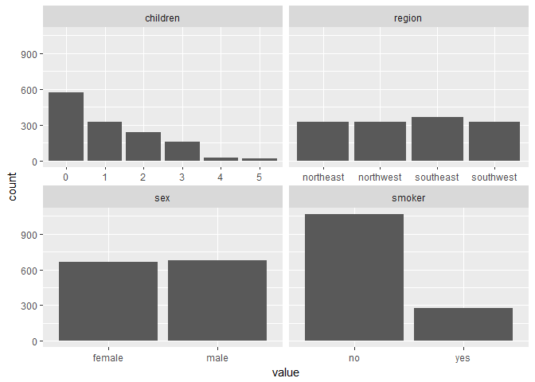

DATA 605 - Discussion 11
================
Joshua Sturm
04/16/2018

1. Data Exploration
===================

``` r
library(tidyverse)
library(knitr)
library(corrplot)
library(gridExtra)
```

1.1 Import Dataset
------------------

``` r
ins <- read.csv("insurance.csv")
```

1.1.1 Data Dictionary
---------------------

``` r
defs <- c("An integer indicating the age of the primary beneficiary (excluding those above 64 years, since they are generally covered by the government)", 
          "The policy holder's gender, either male or female", 
          "The body mass index (BMI), which provides a sense of how over- or under-weight a person is relative to their height. BMI is equal to weight (in kilograms) divided by height (in meters) squared. An ideal BMI is within the range of 18.5 to 24.9", 
          "An integer indicating the number of children/dependents covered by the insurance plan", 
          "A yes or no categorical variable that indicates whether the insured regularly smokes tobacco", 
          "The beneficiary's place of residence in the US, divided into four geographic regions: northeast, southeast, southwest, or northwest", 
          "Dependent variable - measures the medical costs each person charged to the insurance plan for the year")

ins.dict <- data.frame(names(ins), defs, stringsAsFactors = F)
names(ins.dict) <- c("Variable Name", "Definition")

kable(ins.dict)
```

| Variable Name | Definition                                                                                                                                                                                                                                         |
|:--------------|:---------------------------------------------------------------------------------------------------------------------------------------------------------------------------------------------------------------------------------------------------|
| age           | An integer indicating the age of the primary beneficiary (excluding those above 64 years, since they are generally covered by the government)                                                                                                      |
| sex           | The policy holder's gender, either male or female                                                                                                                                                                                                  |
| bmi           | The body mass index (BMI), which provides a sense of how over- or under-weight a person is relative to their height. BMI is equal to weight (in kilograms) divided by height (in meters) squared. An ideal BMI is within the range of 18.5 to 24.9 |
| children      | An integer indicating the number of children/dependents covered by the insurance plan                                                                                                                                                              |
| smoker        | A yes or no categorical variable that indicates whether the insured regularly smokes tobacco                                                                                                                                                       |
| region        | The beneficiary's place of residence in the US, divided into four geographic regions: northeast, southeast, southwest, or northwest                                                                                                                |
| charges       | Dependent variable - measures the medical costs each person charged to the insurance plan for the year                                                                                                                                             |

1.2 Data Structure
------------------

``` r
psych::describe(ins)
##          vars    n     mean       sd  median  trimmed     mad     min
## age         1 1338    39.21    14.05   39.00    39.01   17.79   18.00
## sex*        2 1338     1.51     0.50    2.00     1.51    0.00    1.00
## bmi         3 1338    30.66     6.10   30.40    30.50    6.20   15.96
## children    4 1338     1.09     1.21    1.00     0.94    1.48    0.00
## smoker*     5 1338     1.20     0.40    1.00     1.13    0.00    1.00
## region*     6 1338     2.52     1.10    3.00     2.52    1.48    1.00
## charges     7 1338 13270.42 12110.01 9382.03 11076.02 7440.81 1121.87
##               max    range  skew kurtosis     se
## age         64.00    46.00  0.06    -1.25   0.38
## sex*         2.00     1.00 -0.02    -2.00   0.01
## bmi         53.13    37.17  0.28    -0.06   0.17
## children     5.00     5.00  0.94     0.19   0.03
## smoker*      2.00     1.00  1.46     0.14   0.01
## region*      4.00     3.00 -0.04    -1.33   0.03
## charges  63770.43 62648.55  1.51     1.59 331.07
```

The dataset has 7 variables, and 1338 cases.

1.3 Missing data
----------------

``` r
any(is.na(ins))
## [1] FALSE
```

Amazingly, this dataset has no missing cases, which will simplify our cleaning process!

1.4 Visualizations
------------------

### 1.4.1 Boxplot

``` r
ins.bp <- ins %>%
  select(c(1, 3)) %>%
  gather()

summary.boxplot <- ggplot(ins.bp, aes(x = key, y = value)) +
  labs(x = "variable", title = "Insurance Data Boxplot") +
  geom_boxplot(outlier.colour = "red", outlier.shape = 1)

summary.boxplot
```


### 1.4.2 Histogram

``` r
ins.h <- ins %>%
  select(c(1, 3, 7)) %>%
  gather()

ins.hist <- ggplot(data = ins.h, mapping = aes(x = value)) + 
  geom_histogram(bins = 10) + 
  facet_wrap(~key, scales = 'free_x')

ins.hist
```


### 1.4.3 Bar Chart

``` r
ins.b <- ins %>%
  select(c(2, 4:6)) %>%
  gather()

ins.bar <- ggplot(data = ins.b, mapping = aes(x = value)) + 
  geom_bar() + 
  facet_wrap(~key, scales = 'free_x')

ins.bar
```



### 1.4.4 Correlation

#### 1.4.4.1 Correlation Heatmap

``` r
ins.c <- mutate_all(ins, funs(as.numeric))
corrplot(cor(ins.c), method = "color", type = "lower")
```


#### 1.4.4.2 Correlation (with dependent) table

``` r

corp <- apply(ins.c[, -7], 2, function(x) cor.test(x, y=ins.c$charges)$p.value)
cortable <- cor(ins.c[, -7], ins.c$charges)
kable(cbind(as.character(corp), cortable), col.names = c("P-value", "Correlation with dependent"))
```

|          | P-value              | Correlation with dependent |
|----------|:---------------------|:---------------------------|
| age      | 4.88669333171859e-29 | 0.299008193330648          |
| sex      | 0.0361327210059298   | 0.0572920622020254         |
| bmi      | 2.45908553511669e-13 | 0.198340968833629          |
| children | 0.0128521285201365   | 0.0679982268479048         |
| smoker   | 8.2714358421744e-283 | 0.787251430498477          |
| region   | 0.82051783646525     | -0.00620823490944446       |

Based on the above correlation analyses, one can see that most variables, especially `smoker` and `age`, are positively correlated with the dependent variable `charges`, while `region` has a negative correlation.

2. Data Preparation
===================

2.1 Missing Data
----------------

As noted earlier, the dataset is remarkably whole, so we may proceed without worrying about having to imputate any data.

2.2 Normality of Predictor Variables
------------------------------------

As can be seen in the distribution plots in [section 1.4.2](#histogram), `bmi` appears to be nearly normal, while `age` has a slight right skew. Linear regression does not make any assumptions on the normality of any variables, so I will keep the variables as is.

2.4 Variable Transformation
---------------------------

For one of my models, I will transform `bmi` to a binary variable, with any case having a value inside the accepted range as described in the data dictionary being marked 0, and all others marked 1.

2.5 Outliers
------------

From [section 1.4.1](#boxplot), only `bmi` has outliers. I believe that transforming it to a continuous variable, as outlined in the [preceding section](#variable-transformation).

3. Build Models
===============

3.1 Model 1
-----------

For the first model, I will include all variables as is, to serve as a baseline with which to compare future models that may have transformed variables.

``` r
m1 <- lm(formula = charges ~ .,
         data = ins)
summary(m1)
## 
## Call:
## lm(formula = charges ~ ., data = ins)
## 
## Residuals:
##      Min       1Q   Median       3Q      Max 
## -11304.9  -2848.1   -982.1   1393.9  29992.8 
## 
## Coefficients:
##                 Estimate Std. Error t value Pr(>|t|)    
## (Intercept)     -11938.5      987.8 -12.086  < 2e-16 ***
## age                256.9       11.9  21.587  < 2e-16 ***
## sexmale           -131.3      332.9  -0.394 0.693348    
## bmi                339.2       28.6  11.860  < 2e-16 ***
## children           475.5      137.8   3.451 0.000577 ***
## smokeryes        23848.5      413.1  57.723  < 2e-16 ***
## regionnorthwest   -353.0      476.3  -0.741 0.458769    
## regionsoutheast  -1035.0      478.7  -2.162 0.030782 *  
## regionsouthwest   -960.0      477.9  -2.009 0.044765 *  
## ---
## Signif. codes:  0 '***' 0.001 '**' 0.01 '*' 0.05 '.' 0.1 ' ' 1
## 
## Residual standard error: 6062 on 1329 degrees of freedom
## Multiple R-squared:  0.7509, Adjusted R-squared:  0.7494 
## F-statistic: 500.8 on 8 and 1329 DF,  p-value: < 2.2e-16
```

### 3.1.1 Model 1 Interpretation

The model summary reveals several variables that are insignificant toward predicting the target variable - `sexmale`, and `regionnorthwest`. I'll build a second model, and see if I can improve on this.

3.2 Model 2
-----------

``` r
m2 <- lm(formula = charges ~ . -sex -region,
         data = ins)
summary(m2)
## 
## Call:
## lm(formula = charges ~ . - sex - region, data = ins)
## 
## Residuals:
##      Min       1Q   Median       3Q      Max 
## -11897.9  -2920.8   -986.6   1392.2  29509.6 
## 
## Coefficients:
##              Estimate Std. Error t value Pr(>|t|)    
## (Intercept) -12102.77     941.98 -12.848  < 2e-16 ***
## age            257.85      11.90  21.675  < 2e-16 ***
## bmi            321.85      27.38  11.756  < 2e-16 ***
## children       473.50     137.79   3.436 0.000608 ***
## smokeryes    23811.40     411.22  57.904  < 2e-16 ***
## ---
## Signif. codes:  0 '***' 0.001 '**' 0.01 '*' 0.05 '.' 0.1 ' ' 1
## 
## Residual standard error: 6068 on 1333 degrees of freedom
## Multiple R-squared:  0.7497, Adjusted R-squared:  0.7489 
## F-statistic: 998.1 on 4 and 1333 DF,  p-value: < 2.2e-16
```

3.2.1 Compare models
--------------------

``` r
anova(m2, m1)
## Analysis of Variance Table
## 
## Model 1: charges ~ (age + sex + bmi + children + smoker + region) - sex - 
##     region
## Model 2: charges ~ age + sex + bmi + children + smoker + region
##   Res.Df        RSS Df Sum of Sq      F Pr(>F)
## 1   1333 4.9078e+10                           
## 2   1329 4.8840e+10  4 238917273 1.6253 0.1654
```

It seems that the original model is preferred over the second.

I will build one last model, where I'll transform the `bmi` variable from continuous to binary.

``` r
m3 <- ins %>%
  mutate(overweight = if_else(bmi > 24.9, 1, 0)) %>%
  select(-c(bmi, region, sex))

m3 <- lm(formula = charges ~ .,
         data = m3)
summary(m3)
## 
## Call:
## lm(formula = charges ~ ., data = m3)
## 
## Residuals:
##    Min     1Q Median     3Q    Max 
## -13017  -2500  -1713   1536  28693 
## 
## Coefficients:
##             Estimate Std. Error t value Pr(>|t|)    
## (Intercept) -5349.50     622.63  -8.592  < 2e-16 ***
## age           264.20      12.21  21.641  < 2e-16 ***
## children      497.99     141.62   3.516 0.000452 ***
## smokeryes   23920.52     422.76  56.582  < 2e-16 ***
## overweight   3439.77     445.08   7.728 2.13e-14 ***
## ---
## Signif. codes:  0 '***' 0.001 '**' 0.01 '*' 0.05 '.' 0.1 ' ' 1
## 
## Residual standard error: 6236 on 1333 degrees of freedom
## Multiple R-squared:  0.7356, Adjusted R-squared:  0.7348 
## F-statistic: 927.1 on 4 and 1333 DF,  p-value: < 2.2e-16
anova(m3, m1)
## Analysis of Variance Table
## 
## Model 1: charges ~ age + children + smoker + overweight
## Model 2: charges ~ age + sex + bmi + children + smoker + region
##   Res.Df        RSS Df  Sum of Sq      F    Pr(>F)    
## 1   1333 5.1844e+10                                   
## 2   1329 4.8840e+10  4 3004332616 20.438 2.338e-16 ***
## ---
## Signif. codes:  0 '***' 0.001 '**' 0.01 '*' 0.05 '.' 0.1 ' ' 1
```

Once again, the first model outperforms the newer one, so we will use model 1 for our predictions.

4. Model Selection
==================

4.1 Split Data
--------------

``` r
set.seed(858)

# Split data into training and testing partitions
train <- ins %>%
  sample_frac(., size = 0.7, replace = F)
test <- anti_join(ins, train)
```

4.3 Prediction
--------------

``` r
model1 <- lm(formula = charges ~ .,
             data = train)
```

``` r
predicted.charges <- predict(object = model1, newdata = test, type = "response")
```

``` r
model1 <- lm(formula = charges ~ .,
             data = train)

rp1 <- ggplot(model1, aes(.fitted, .resid)) +
  geom_point() +
  geom_hline(yintercept = 0) +
  geom_smooth(se = FALSE) +
  labs(title = "Residuals vs Fitted")

rp2 <- ggplot(model1, aes(.fitted, .stdresid)) +
  geom_point() +
  geom_hline(yintercept = 0) +
  geom_smooth(se = FALSE)

rp3 <- ggplot(model1) +
  stat_qq(aes(sample = .stdresid)) +
  geom_abline()

rp4 <- ggplot(model1, aes(.fitted, sqrt(abs(.stdresid)))) +
  geom_point() +
  geom_smooth(se = FALSE) +
  labs(title = "Scale-Location")

rp5 <- ggplot(model1, aes(seq_along(.cooksd), .cooksd)) +
  geom_col() +
  ylim(0, 0.0075) +
  labs(title = "Cook's Distance")

rp6 <- ggplot(model1, aes(.hat, .stdresid)) +
  geom_point(aes(size = .cooksd)) +
  geom_smooth(se = FALSE, size = 0.5) +
  labs(title = "Residuals vs Leverage")

rp7 <- ggplot(model1, aes(.hat, .cooksd)) +
  geom_vline(xintercept = 0, colour = NA) +
  geom_abline(slope = seq(0, 3, by = 0.5), colour = "white") +
  geom_smooth(se = FALSE) +
  geom_point() +
  labs(title = "Cook's distance vs Leverage")

rp8 <- ggplot(model1, aes(.resid)) +
  geom_histogram(bins = 7, color="darkblue", fill="steelblue")

grid.arrange(rp1, rp2, rp3, rp4, rp5, rp6, rp7, rp8, ncol = 2)
```


From the above visualizations, the residuals appear to be close enough to normal, so I'll proceed with using the model to make predictions.

4.4 Prediction Results
----------------------

``` r
results.df <- data.frame(cbind(actuals = test$charges, predicted = predicted.charges))

results.df <- results.df %>%
  mutate(error = results.df$actuals - results.df$predicted) %>%
  round(., 2)
results.df <- results.df %>%
  mutate(percerror = paste0(round(results.df$error/results.df$actuals*100,2),"%"))

kable(head(results.df))
```

|   actuals|  predicted|     error| percerror |
|---------:|----------:|---------:|:----------|
|   4449.46|    6702.10|  -2252.64| -50.63%   |
|   3756.62|    4105.21|   -348.59| -9.28%    |
|   6406.41|    8537.00|  -2130.59| -33.26%   |
|   1826.84|    4332.64|  -2505.80| -137.17%  |
|  11090.72|   14850.72|  -3760.01| -33.9%    |
|  36837.47|   29908.33|   6929.14| 18.81%    |

``` r
sprintf("The mean percent error is: %s%%", round(mean(results.df$error/results.df$actuals*100), 2))
```

    ## [1] "The mean percent error is: -19.31%"

5. Remarks
==========

Our model was able to predict the insurance premium for policy holders with a mean difference of ~19%.

While `sex` and `region` were not major contributors to the model, the model with those variables removed actually performed slightly worse. Perhaps if `region` was further broken down by state, it might provide more explanatory power.

As one would expect, `smoker` is *highly* correlated with `charges` - that is, a smoker is very likely to have a higher premium.
