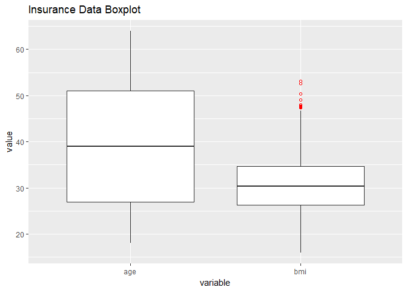
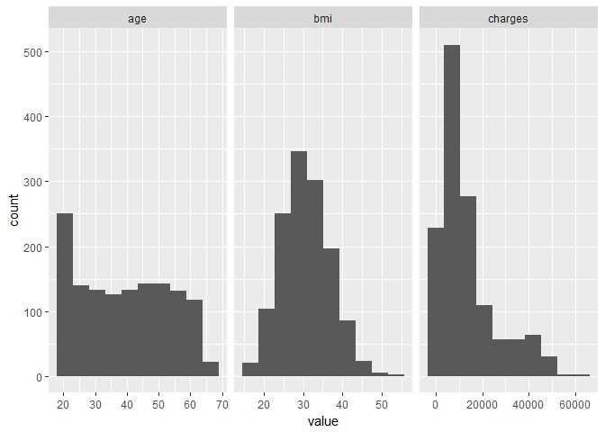
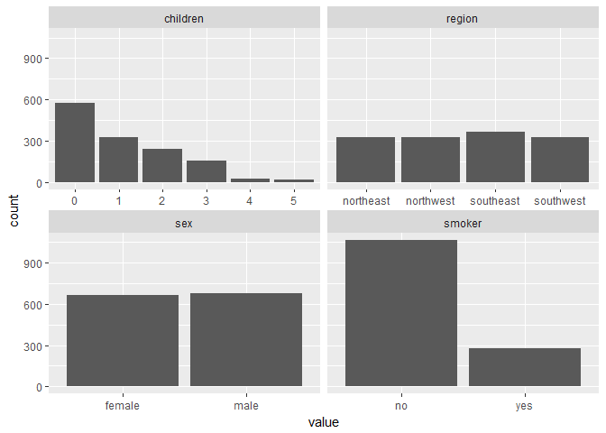
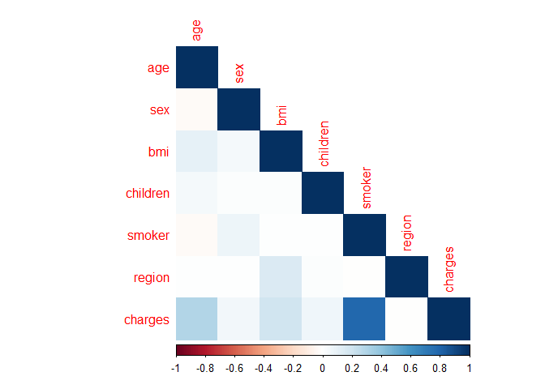
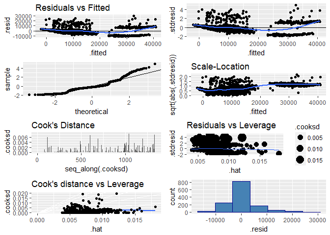

DATA 605 - Discussion 12
================
Joshua Sturm
April 27, 2018

Objective
=========

Using R, build a multiple regression model for data that interests you. Include in this model at least one quadratic term, one dichotomous term, and one dichotomous vs. quantitative interaction term. Interpret all coefficients. Conduct residual analysis. Was the linear model appropriate? Why or why not?

I will continue with the work I did for discussion 11, and include an interaction term in the model to see how it compares with the base model.

1. Data Exploration
===================

``` r
library(tidyverse)
library(knitr)
library(corrplot)
library(gridExtra)
```

1.1 Import Dataset
------------------

``` r
ins <- read.csv("insurance.csv")
```

1.1.1 Data Dictionary
---------------------

``` r
defs <- c("An integer indicating the age of the primary beneficiary (excluding those above 64 years, since they are generally covered by the government)", 
          "The policy holder's gender, either male or female", 
          "The body mass index (BMI), which provides a sense of how over- or under-weight a person is relative to their height. BMI is equal to weight (in kilograms) divided by height (in meters) squared. An ideal BMI is within the range of 18.5 to 24.9", 
          "An integer indicating the number of children/dependents covered by the insurance plan", 
          "A yes or no categorical variable that indicates whether the insured regularly smokes tobacco", 
          "The beneficiary's place of residence in the US, divided into four geographic regions: northeast, southeast, southwest, or northwest", 
          "Dependent variable - measures the medical costs each person charged to the insurance plan for the year")

ins.dict <- data.frame(names(ins), defs, stringsAsFactors = F)
names(ins.dict) <- c("Variable Name", "Definition")

kable(ins.dict)
```

| Variable Name | Definition                                                                                                                                                                                                                                         |
|:--------------|:---------------------------------------------------------------------------------------------------------------------------------------------------------------------------------------------------------------------------------------------------|
| age           | An integer indicating the age of the primary beneficiary (excluding those above 64 years, since they are generally covered by the government)                                                                                                      |
| sex           | The policy holder's gender, either male or female                                                                                                                                                                                                  |
| bmi           | The body mass index (BMI), which provides a sense of how over- or under-weight a person is relative to their height. BMI is equal to weight (in kilograms) divided by height (in meters) squared. An ideal BMI is within the range of 18.5 to 24.9 |
| children      | An integer indicating the number of children/dependents covered by the insurance plan                                                                                                                                                              |
| smoker        | A yes or no categorical variable that indicates whether the insured regularly smokes tobacco                                                                                                                                                       |
| region        | The beneficiary's place of residence in the US, divided into four geographic regions: northeast, southeast, southwest, or northwest                                                                                                                |
| charges       | Dependent variable - measures the medical costs each person charged to the insurance plan for the year                                                                                                                                             |

1.2 Data Structure
------------------

``` r
psych::describe(ins)
##          vars    n     mean       sd  median  trimmed     mad     min
## age         1 1338    39.21    14.05   39.00    39.01   17.79   18.00
## sex*        2 1338     1.51     0.50    2.00     1.51    0.00    1.00
## bmi         3 1338    30.66     6.10   30.40    30.50    6.20   15.96
## children    4 1338     1.09     1.21    1.00     0.94    1.48    0.00
## smoker*     5 1338     1.20     0.40    1.00     1.13    0.00    1.00
## region*     6 1338     2.52     1.10    3.00     2.52    1.48    1.00
## charges     7 1338 13270.42 12110.01 9382.03 11076.02 7440.81 1121.87
##               max    range  skew kurtosis     se
## age         64.00    46.00  0.06    -1.25   0.38
## sex*         2.00     1.00 -0.02    -2.00   0.01
## bmi         53.13    37.17  0.28    -0.06   0.17
## children     5.00     5.00  0.94     0.19   0.03
## smoker*      2.00     1.00  1.46     0.14   0.01
## region*      4.00     3.00 -0.04    -1.33   0.03
## charges  63770.43 62648.55  1.51     1.59 331.07
```

The dataset has 7 variables, and 1338 cases.

1.3 Missing data
----------------

``` r
any(is.na(ins))
## [1] FALSE
```

Amazingly, this dataset has no missing cases, which will simplify our cleaning process!

1.4 Visualizations
------------------

### 1.4.1 Boxplot

``` r
ins.bp <- ins %>%
  select(c(1, 3)) %>%
  gather()

summary.boxplot <- ggplot(ins.bp, aes(x = key, y = value)) +
  labs(x = "variable", title = "Insurance Data Boxplot") +
  geom_boxplot(outlier.colour = "red", outlier.shape = 1)

summary.boxplot
```



### 1.4.2 Histogram

``` r
ins.h <- ins %>%
  select(c(1, 3, 7)) %>%
  gather()

ins.hist <- ggplot(data = ins.h, mapping = aes(x = value)) + 
  geom_histogram(bins = 10) + 
  facet_wrap(~key, scales = 'free_x')

ins.hist
```



### 1.4.3 Bar Chart

``` r
ins.b <- ins %>%
  select(c(2, 4:6)) %>%
  gather()

ins.bar <- ggplot(data = ins.b, mapping = aes(x = value)) + 
  geom_bar() + 
  facet_wrap(~key, scales = 'free_x')

ins.bar
```



### 1.4.4 Correlation

#### 1.4.4.1 Correlation Heatmap

``` r
ins.c <- mutate_all(ins, funs(as.numeric))
corrplot(cor(ins.c), method = "color", type = "lower")
```



#### 1.4.4.2 Correlation (with dependent) table

``` r

corp <- apply(ins.c[, -7], 2, function(x) cor.test(x, y=ins.c$charges)$p.value)
cortable <- cor(ins.c[, -7], ins.c$charges)
kable(cbind(as.character(corp), cortable), col.names = c("P-value", "Correlation with dependent"))
```

|          | P-value              | Correlation with dependent |
|----------|:---------------------|:---------------------------|
| age      | 4.88669333171859e-29 | 0.299008193330648          |
| sex      | 0.0361327210059298   | 0.0572920622020254         |
| bmi      | 2.45908553511669e-13 | 0.198340968833629          |
| children | 0.0128521285201365   | 0.0679982268479048         |
| smoker   | 8.2714358421744e-283 | 0.787251430498477          |
| region   | 0.82051783646525     | -0.00620823490944446       |

Based on the above correlation analyses, one can see that most variables, especially `smoker` and `age`, are positively correlated with the dependent variable `charges`, while `region` has a negative correlation.

2. Model 1 - Base
=================

``` r
m1 <- lm(formula = charges ~ .,
         data = ins)
summary(m1)
## 
## Call:
## lm(formula = charges ~ ., data = ins)
## 
## Residuals:
##      Min       1Q   Median       3Q      Max 
## -11304.9  -2848.1   -982.1   1393.9  29992.8 
## 
## Coefficients:
##                 Estimate Std. Error t value Pr(>|t|)    
## (Intercept)     -11938.5      987.8 -12.086  < 2e-16 ***
## age                256.9       11.9  21.587  < 2e-16 ***
## sexmale           -131.3      332.9  -0.394 0.693348    
## bmi                339.2       28.6  11.860  < 2e-16 ***
## children           475.5      137.8   3.451 0.000577 ***
## smokeryes        23848.5      413.1  57.723  < 2e-16 ***
## regionnorthwest   -353.0      476.3  -0.741 0.458769    
## regionsoutheast  -1035.0      478.7  -2.162 0.030782 *  
## regionsouthwest   -960.0      477.9  -2.009 0.044765 *  
## ---
## Signif. codes:  0 '***' 0.001 '**' 0.01 '*' 0.05 '.' 0.1 ' ' 1
## 
## Residual standard error: 6062 on 1329 degrees of freedom
## Multiple R-squared:  0.7509, Adjusted R-squared:  0.7494 
## F-statistic: 500.8 on 8 and 1329 DF,  p-value: < 2.2e-16
```

3. Model 2 - Including an interaction term
==========================================

For this model, we'll include the interaction term `age*bmi`, and see how it compares with the base model.

``` r
m2 <- lm(formula = charges ~ . + age*bmi,
         data = ins)
summary(m2)
## 
## Call:
## lm(formula = charges ~ . + age * bmi, data = ins)
## 
## Residuals:
##      Min       1Q   Median       3Q      Max 
## -11303.6  -2844.9   -982.8   1385.6  29993.4 
## 
## Coefficients:
##                   Estimate Std. Error t value Pr(>|t|)    
## (Intercept)     -1.170e+04  2.498e+03  -4.682 3.13e-06 ***
## age              2.506e+02  6.117e+01   4.096 4.46e-05 ***
## sexmale         -1.320e+02  3.331e+02  -0.396 0.692062    
## bmi              3.313e+02  8.023e+01   4.130 3.86e-05 ***
## children         4.753e+02  1.379e+02   3.448 0.000583 ***
## smokeryes        2.385e+04  4.134e+02  57.690  < 2e-16 ***
## regionnorthwest -3.518e+02  4.766e+02  -0.738 0.460592    
## regionsoutheast -1.033e+03  4.792e+02  -2.156 0.031267 *  
## regionsouthwest -9.609e+02  4.782e+02  -2.010 0.044682 *  
## age:bmi          2.041e-01  1.943e+00   0.105 0.916341    
## ---
## Signif. codes:  0 '***' 0.001 '**' 0.01 '*' 0.05 '.' 0.1 ' ' 1
## 
## Residual standard error: 6064 on 1328 degrees of freedom
## Multiple R-squared:  0.7509, Adjusted R-squared:  0.7492 
## F-statistic: 444.8 on 9 and 1328 DF,  p-value: < 2.2e-16
anova(m2, m1)
## Analysis of Variance Table
## 
## Model 1: charges ~ age + sex + bmi + children + smoker + region + age * 
##     bmi
## Model 2: charges ~ age + sex + bmi + children + smoker + region
##   Res.Df        RSS Df Sum of Sq     F Pr(>F)
## 1   1328 4.8839e+10                          
## 2   1329 4.8840e+10 -1   -405956 0.011 0.9163
```

The model has a poorer adjusted r-squared, but a lower f-stat. Additionally, a chi-square test using the `anova` function tells us these models aren't very different, which suggests the additional interaction term does not add anything in terms of explanatory power. While the first model is not perfect (it would require some variable transformations to be used in production), it is somewhat preferred over this newer one.

``` r

rp1 <- ggplot(m1, aes(.fitted, .resid)) +
  geom_point() +
  geom_hline(yintercept = 0) +
  geom_smooth(se = FALSE) +
  labs(title = "Residuals vs Fitted")

rp2 <- ggplot(m1, aes(.fitted, .stdresid)) +
  geom_point() +
  geom_hline(yintercept = 0) +
  geom_smooth(se = FALSE)

rp3 <- ggplot(m1) +
  stat_qq(aes(sample = .stdresid)) +
  geom_abline()

rp4 <- ggplot(m1, aes(.fitted, sqrt(abs(.stdresid)))) +
  geom_point() +
  geom_smooth(se = FALSE) +
  labs(title = "Scale-Location")

rp5 <- ggplot(m1, aes(seq_along(.cooksd), .cooksd)) +
  geom_col() +
  ylim(0, 0.0075) +
  labs(title = "Cook's Distance")

rp6 <- ggplot(m1, aes(.hat, .stdresid)) +
  geom_point(aes(size = .cooksd)) +
  geom_smooth(se = FALSE, size = 0.5) +
  labs(title = "Residuals vs Leverage")

rp7 <- ggplot(m1, aes(.hat, .cooksd)) +
  geom_vline(xintercept = 0, colour = NA) +
  geom_abline(slope = seq(0, 3, by = 0.5), colour = "white") +
  geom_smooth(se = FALSE) +
  geom_point() +
  labs(title = "Cook's distance vs Leverage")

rp8 <- ggplot(m1, aes(.resid)) +
  geom_histogram(bins = 7, color="darkblue", fill="steelblue")

grid.arrange(rp1, rp2, rp3, rp4, rp5, rp6, rp7, rp8, ncol = 2)
```


